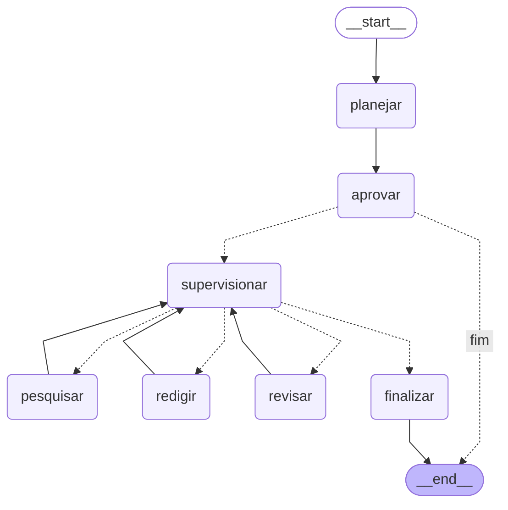

# Grafo da equipe

Atualizado em 01/11/2026 18:55 (Brasília).

Grafo LangGraph compilado a partir de `apogeu/grafo.py`.

```mermaid
---
config:
  flowchart:
    curve: linear
---
graph TD;
	__start__([<p>__start__</p>]):::first
	planejar(planejar)
	aprovar(aprovar)
	supervisionar(supervisionar)
	pesquisar(pesquisar)
	redigir(redigir)
	revisar(revisar)
	finalizar(finalizar)
	__end__([<p>__end__</p>]):::last
	__start__ --> planejar;
	aprovar -. &nbsp;fim&nbsp; .-> __end__;
	aprovar -.-> supervisionar;
	pesquisar --> supervisionar;
	planejar --> aprovar;
	redigir --> supervisionar;
	revisar --> supervisionar;
	supervisionar -.-> finalizar;
	supervisionar -.-> pesquisar;
	supervisionar -.-> redigir;
	supervisionar -.-> revisar;
	finalizar --> __end__;
	classDef default fill:#f2f0ff,line-height:1.2
	classDef first fill-opacity:0
	classDef last fill:#bfb6fc
```
